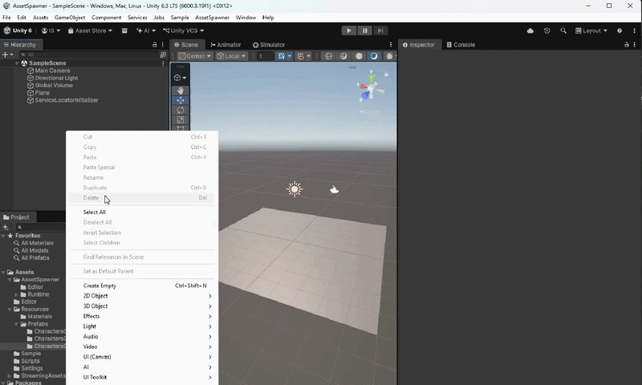
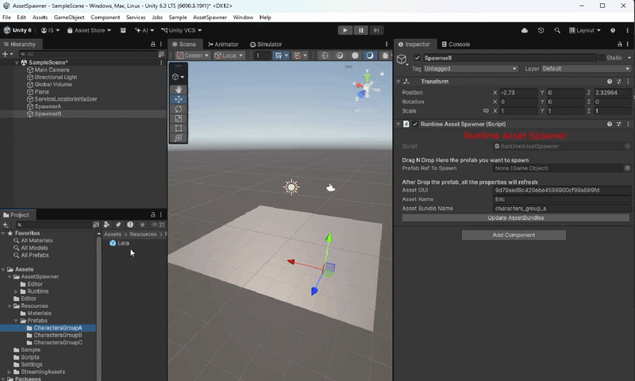
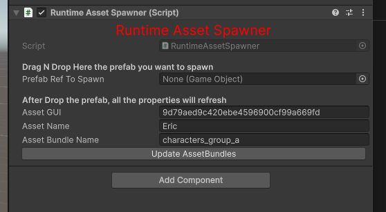
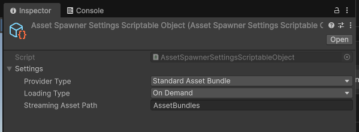
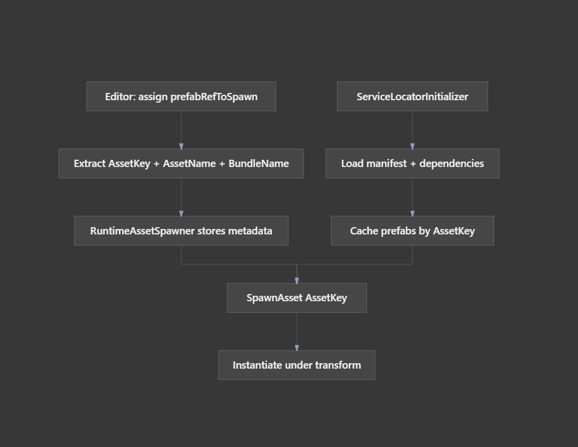

# AssetSpawner

Asset Spawner Solution for helping Artists or Non-Technical members to Spawn Prefabs on a Unity Scene at Runtime

## Big Pros by Using AssetSpawner

1. Zero dependencies on a Unity Scene
2. No prefabs/gameobjects serialized
3. No memory allocation in the builds
4. Designed as a Unity Package (https://docs.unity3d.com/Manual/cus-layout.html)  

## Component Overview

- RuntimeAssetSpawner is a monobehavior that allows you to attach to an empty GameObject, drag and drop a prefab, and it is going to be loaded and instantiated at runtime.

### How to Use:

There's a SampleScene in the project to open it in: Assets/Sample/SampleScene

There is a video attached in Amber\Media\asset_spawner_how_to_use.mp4 to show the usage in these steps: 
1. Create an empty object in the scene, and set the position to spawn the prefab
2. Attach the RuntimeAssetSpawner to the GameObject that you created
3. Drag and drop a prefab to the script field called: "PrefabToSpawn"
4. The data of the prefab will be extracted, and the fields will be refreshed with that information
5. (Optional) If you added new prefabs, renamed or changed the folders, and you want to reflect the changes in the AssetBundles, you can tap the button "Update AssetBundles" in the Script (Videos Attached as well )
6. Run the Sample Scene

### AssetSpawner Settings

The implementation follows a settings as a source of truth that allows to set different behaviors: 

- Provider Type: 
- Loading Type: 
- Streaming AssetPath: 

### Architecture Overview:

ServiceLocatorInitializer: By implementing this design pattern, we can use only one instance of a service that will be responsible for making the entire
Asset bundles are loading once. 

(EditorScript) AssetBundleBuilder: When a new prefab is being attached to the script, the builder is responsible for extracting the info and setting it to the monobehavior.
It also provides an option to build all the asset bundles, and cover the corner case to send the prefabs to a generic asset bundle group in case the asset bundle is not set 
on the prefab itself.

IAssetSpawnerService: AssetSpawnerService: The Service injected and responsible for managing the initialization flow of the bundles loaded and the assets inside of it.
The service is doing an async implementation to: 
- Getting all the available asset bundles and loaded it
- Extract all the GameObjects inside the bundles and cache them per type
- Provide an element to be spawned in an O(1) code complexity
- Manages a Manifest JSON with the most up-to-date information of the live GUIDs available in the AssetBundles  

### How to expand: 

- Currently, AssetSpawnerService is using the Streaming Assets folder and Asset Bundles.
In case we want to change to a different solution, it can be easily changed in the injection layer: 
For example: different versions of the implementation ( RemoteUrlAssetSpawnerService  or  AssetSpawnerServiceFromAddressables)
can be injected 

### Next improvements: 

- For all the Async Flow, coroutines are implemented, but it can be done by using Tasks with zero memory allocation in the future:(https://github.com/cysharp/unitask)
- AssetSpawnerService is currently loading all the game objects and caching on a dictionary, but it can also implement a version that can load
only when it's requested.
